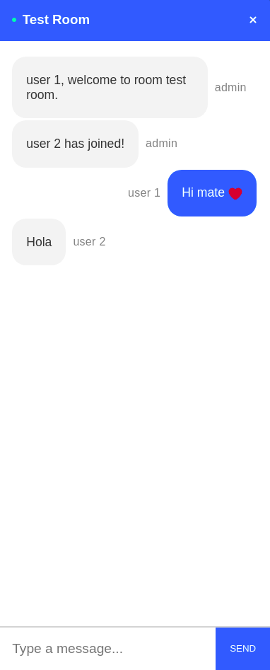

# PLEX

What is it?
PLEX is a online watch-party app that that allows you to stream videos of different websites and chat simultaneously with your peers, all in real time !

## Tech Stack

- React JS
- Node JS
- Express
- Websockets (Socket.io)
- React Player (NPM library)

## Main Features

1. The web app allows to play videos and audio(for SoundCloud and MixCloud) from the following websites �

- YouTube
- Facebook
- Twitch
- MixCloud
- DailyMotion
- Vimeo
- Wistia
  Logos of all these websites are shown in the landing page of the web app for user-friendly experience

2. The webapp can host multiple rooms at once
3. The user, other than the host, just needs to enter the correct room name to enter a watcharty
4. The videos are completely sychronised over the network and play simultaneously

## Setup

For setup, one has to clone the repository into his or her system, install the server and client dependencies by running the command npm install and then use the command npm start to run the webapp

## Snippets

#### Landing Page

#### Sychronised players

#### Chat Box

